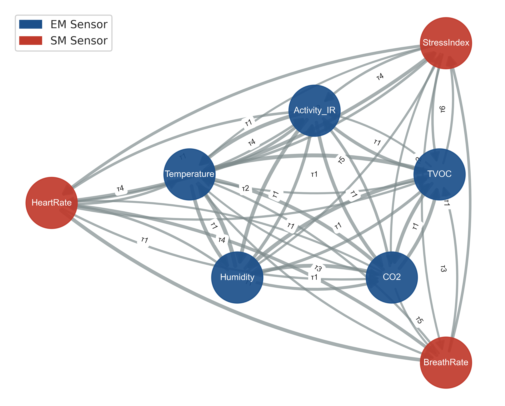

# Causal-Guided Multimodal Fusion for Elderly Risk Detection

> **Anonymous submission** — Under review at an anonymous journal.  
> Code and data pipeline for reproducibility.

---

## Overview

This repository contains the full implementation of **CausalGNN**, a temporal causal discovery–guided graph neural network for multimodal elderly risk detection.

We use PCMCI+ to automatically discover lagged causal structures among heterogeneous sensor streams (environmental, vital-sign, emergency), then inject the discovered causal graph as the edge structure of a Graph Attention Network for risk classification.

<p align="center">
  
</p>

---

## Key Results

| Model | Macro F1 | Binary F1 | AUC-ROC |
|---|---|---|---|
| Single-Modal (EM) | 0.4765 | 0.2475 | 0.4798 |
| Early Fusion | 0.4917 | 0.2451 | 0.4735 |
| Attention Fusion | 0.4362 | 0.2563 | 0.4620 |
| Transformer Fusion | 0.4252 | 0.2453 | 0.4429 |
| **CausalGNN (Ours)** | **0.7033** | **0.5522** | **0.8079** |

- **+43% Macro F1** and **+68% AUC-ROC** over best baseline
- Generalization gap of only **−0.035 AUC** across unseen households
- 57% of Danger events concentrate between 00:00–05:59, motivating lag-aware causal modeling

---

## Repository Structure

```
causal-gnn-elderly-risk/
│
├── 01_eda.ipynb                  # Extended EDA & data validation
├── 02_pcmci.ipynb                # Temporal causal discovery (PCMCI+)
├── 03_causal_gnn.ipynb           # CausalGNN training & evaluation
├── 04_baseline.ipynb             # Baseline model comparison
├── 05_ablation.ipynb             # Ablation study (graph / modality / lag)
├── 06_generalization.ipynb       # Cross-household generalization test
├── 07_figures.ipynb              # Publication-quality figures (600 DPI)
│
├── figures/                      # All paper figures (PDF + PNG)
│   ├── fig1_label_dist.*
│   ├── fig2_lag_ccf.*
│   ├── fig3_causal_dag.*
│   ├── fig4_causal_freq_heatmap.*
│   ├── fig5_model_comparison.*
│   ├── fig6_ablation.*
│   ├── fig7_generalization.*
│   └── fig8_sensor_boxplot.*
│
├── results/                      # Saved metrics & model outputs
│   ├── causal_links_all.csv
│   ├── stable_causal_links.csv
│   ├── causal_adj.npy
│   ├── best_causal_gnn.pt
│   ├── metrics_all_models.csv
│   ├── ablation_*.csv
│   ├── generalization_results.csv
│   └── per_household_performance.csv
│
├── data_cache/                   # Preprocessed cache (auto-generated)
│   └── df_new.pkl
│
├── DATA_PATH.txt                 # Points to raw data root (local only)
├── folder_setup.py               # Project directory initialisation
├── requirements.txt
└── README.md
```

> **Note:** Raw data (`Training/`, `Validation/`, `IR_Images/`) are not included due to data use agreement. See [Data Access](#data-access) below.

---

## Method

### Pipeline

```
Raw Sensor Data (EM + SM + ER)
        │
        ▼
  [1] Gap-aware Segmentation
      Split at gaps > 15 min per household
        │
        ▼
  [2] Temporal Causal Discovery (PCMCI+)
      · ParCorr independence test
      · τ = 1–6 lags (10–60 min)
      · α = 0.05
      → Stable causal links (freq ≥ 50% across households)
        │
        ▼
  [3] Causal Graph → GNN Edge Structure
      · Adjacency matrix: (8 sensors × 8 sensors × 7 lags)
      · 181 directed causal edges
        │
        ▼
  [4] CausalGNN
      · Temporal Encoder: 1D Conv per sensor node
      · Causal GAT × 2: lag-weighted message passing
      · Global Mean Pool → MLP classifier
        │
        ▼
  Risk Classification (Normal / Risk)
```

### Discovered Causal Paths (stable, freq = 100%)

```
Activity_IR(t-1)  →  Risk_bin(t)       [10 min lead]
HeartRate(t-1)    →  Risk_bin(t)       [10 min lead]
Activity_IR(t-1)  →  HeartRate(t)      [cross-modal]
HeartRate(t-1)    →  BreathRate(t)     [cross-modal]
CO2(t-1)          →  Risk_bin(t)       [environmental]
```

---

## Requirements

```
python >= 3.9
torch >= 2.0
torch-geometric
tigramite
scikit-learn
pandas
numpy
seaborn
matplotlib
networkx
```

Install:

```bash
pip install -r requirements.txt
```

---

## Quickstart

### 1. Set up project directory

```bash
# Run from the raw data root directory
python folder_setup.py
```

### 2. Run notebooks in order

```bash
cd causal_fusion_paper/
jupyter notebook
```

Execute notebooks `01` → `07` in sequence.  
Parquet/pickle cache is auto-generated on first run of `01_eda.ipynb`.

### 3. Results

All metrics are saved to `results/` and figures to `figures/` automatically.

---

## Data Access

The dataset is sourced from **AI Hub (Korea)** — *Elderly Care Risk Detection Dataset*.

- Access: [https://aihub.or.kr](https://aihub.or.kr) (registration required)
- After download, place the extracted folder so that `Training/` and `Validation/` are at the root level
- Run `folder_setup.py` to register the data path

---

## Reproducibility

| Component | Fixed seed |
|---|---|
| NumPy | `np.random.seed(42)` |
| PyTorch | `torch.manual_seed(42)` |
| Household split | `np.random.default_rng(42)` |

All experiments were run on a single NVIDIA GPU (CUDA 12.4, PyTorch 2.6).

---

## License

This repository is released for **review purposes only**.  
License will be updated upon acceptance.

---

## Citation

```bibtex
@article{anonymous2026causal,
  title   = {Causal-Guided Multimodal Fusion for Elderly Risk Detection},
  author  = {Anonymous},
  journal = {Anonymous Journal},
  year    = {2026},
  note    = {Under review}
}
```
